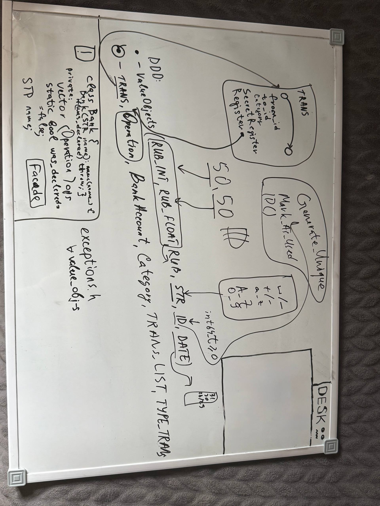

**Запуск:**
```
g++ -std=c++17 -Wall -Wextra main.cpp src/*.cpp -o x-bank && ./x-bank
```

ниже readme.md, который сгенерировал ии по моему коду:
# X-Bank Task (Домашняя работа №2)

## Общая идея

Проект реализует модуль «Учёт финансов» в виде консольного приложения на C++17.
Реализована доменная модель банка с поддержкой счетов, операций (доход/расход), категорий и импорта данных из JSON.

Программа демонстрирует:

* создание банковских счетов;
* выполнение переводов;
* хранение транзакций;
* импорт операций из файла;
* вывод логов.

---

## Реализованная доменная модель

### 1. BankAccount
* id — уникальный идентификатор
* name — имя счёта
* balance — баланс
* хранит список транзакций (`TRANS_LIST`)
Содержит бизнес-логику:
* пополнение
* списание
* регистрация транзакций
---

### 2. Category
* id
* тип (доход/расход)
* название
Используется для классификации операций.
---

### 3. Operation
* id
* тип
* счёт
* сумма
* дата
* описание
* категория
Представляет запись в журнале операций.
---

### Дополнительные классы

#### Value Objects
* `ID` — уникальный идентификатор
* `STR` — строка с валидацией
* `DATE` — дата с проверкой
* `RUB` — деньги (рубли + копейки)
* `TYPE_TRANS` — тип операции
---

## Использованные паттерны (GoF)

### 1. Фасад (Facade)
**Класс:** `BankFacade`
Объединяет работу с:
* счетами
* операциями
Позволяет вызывать одну точку входа вместо работы с множеством классов.
✔ Даёт упрощённый API
---

### 2. Фабрика (Factory)
**Класс:** `BankAccountFactory`
Используется для:
* создания банковских счетов
✔ Централизует создание объектов
✔ Убирает дублирование
---

### 3. Шаблонный метод (Template Method)
**Классы:**
* `OperationImporter` (базовый)
* `JSONOperationImporter` (наследник)
Алгоритм:
1. загрузка данных
2. парсинг (переопределяется)
3. создание операций
---

### 4. Паттерн Команда
Операции регистрации транзакций инкапсулированы в методы:
* `Register`
* `SecretRegister`
---

## DDD (Domain-Driven Design)
### ✔ Rich Domain Model
* `BankAccount` содержит бизнес-логику
### ✔ Value Objects
* ID, DATE, RUB, STR
### ✔ Изоляция домена
* доменная модель не зависит от внешних библиотек
---

## Импорт данных
Реализован импорт из JSON:
Файл: `operations.json`
Особенности:
* парсинг через строки (без библиотек)
* извлечение полей вручную
---

## Сборка и запуск
```bash
g++ -std=c++17 -Wall -Wextra main.cpp src/*.cpp -o x-bank
./x-bank
```
---

## Соответствие требованиям задания

### Основной функционал (2 балла)
✔ создание счетов
✔ операции
✔ категории
✔ импорт

➡️ **2 / 2 балла**

---

### Паттерны (max 6 баллов)
* Facade ✔
* Factory ✔
* Template Method ✔
* Command ✔
* Visitor-частично
➡️ **4+[visitor] / 6 баллов**
---

### DDD (2 балла)
* Rich Domain Model ✔
* Value Objects ✔
* Изоляция ✔
➡️ **2 / 2 балла**
---